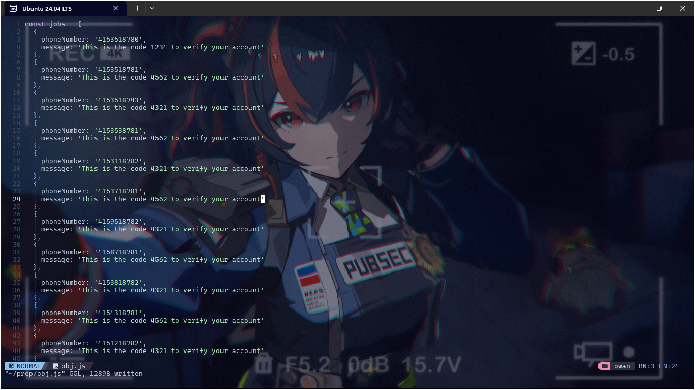
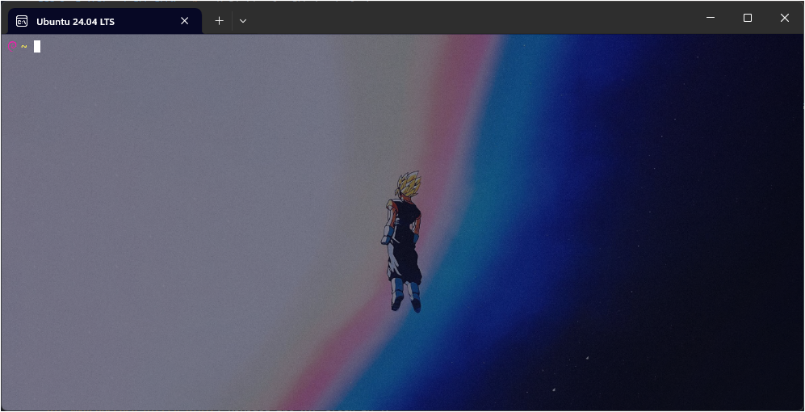
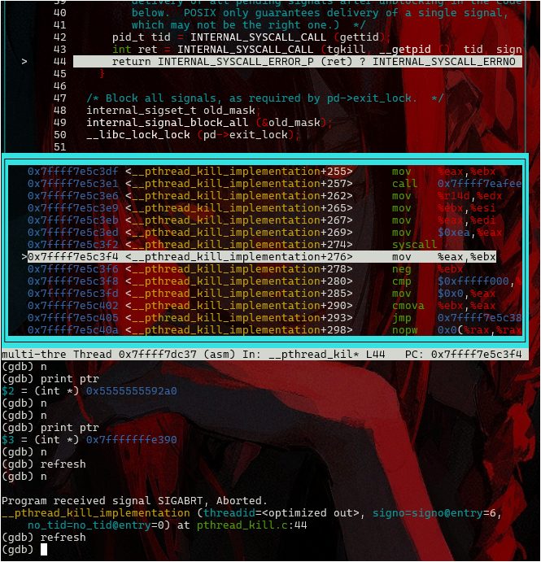
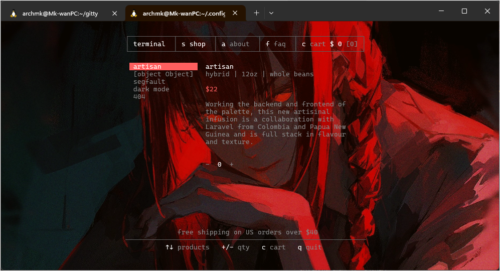

## How to Rice Your WSL Terminal v1.0.0
<center>  </center>
### Initial Setup

First off, I believe you have already installed WSL in your Windows Terminal. If not, just run the following command:
```sh
wsl --install
```
By default, it will install the latest Ubuntu OS available at the moment. Complete all the necessary login information and finish the installation. After everything is done, you will need to update all your packages using the following commands:
```sh
sudo apt update -y  # This will update your Ubuntu instance in the Windows Terminal.
sudo apt upgrade -y # This will upgrade all the required packages that need upgrading.
```

### Add-ons (Not Required but Highly Recommended)

1. Visit the Nerd Fonts website to download fonts that will support some dev-icons later on. [Nerd Fonts](https://www.nerdfonts.com/)
2. Choose any font you like, download it, and extract the zip file to a directory of your choice.
3. Open the font you want to use, and at the top left corner of the window, you should see an install button. Click it to install the font into your system.
4. Close the tab, and now open a new instance of the terminal. Press `<CTRL>,` to open your terminal settings.
5. Hover over the defaults icon. Once there, you should be able to see all the available options to make the changes you like.

#### Here Are My Default Settings

- Most of the options are left by default, but you can still select them to fit your liking.
- Go to Additional Settings > Appearance. You should see a window similar to mine:

  

### Customization

Now we are on the most fun part of making customization.

1. For themes, you will need to add some of them. I get mine from this site: [Windows Terminal Themes](https://windowsterminalthemes.dev/)
2. Feel free to select the ones you like.
3. Play around with the other options to fit your preferences.
4. For the background image, scroll down to the respective option and select the image you like.

### Another Way to Customize

1. When downloading the terminal theme as mentioned above, the color schemes will be copied to your clipboard, and you need to know where to place it.
2. Below the photo above, you can view the settings icon with `Open JSON file`. This is where all your settings are stored once you have saved all the changes.
3. Open the file, and by default, it will open with your preferred editor.
4. Go to the color scheme option and copy it there.

  

5. Right under these schemes, add a `,` after the closing brackets of the previous scheme.
6. Then paste the downloaded theme from the Windows Terminal Themes.
7. After all is done, close the file and fire up your terminal. Head over to Defaults > Appearance > Color Schemes. There you should see your downloaded scheme.
8. Here is my finished product:

  

Don't forget to share your riced terminal on X if you were successful with this guide: [@k_flowstate](https://x.com/k_flowstate/status/1816499292137267404).

---

If you have any further adjustments or specific areas you'd like to improve, let me know!
